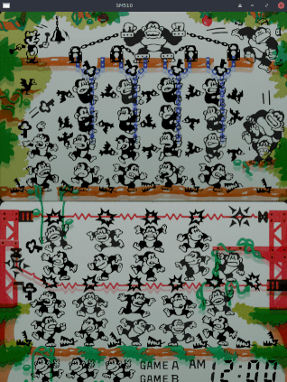

Sharp SM510
---

This is a very basic version of the SM510 Microcontroller in Verilog. It has been tested with two **Game & Watch** games. It was developed mainly on my phone with Termux running Ubuntu, Verilator & GTKWave.

